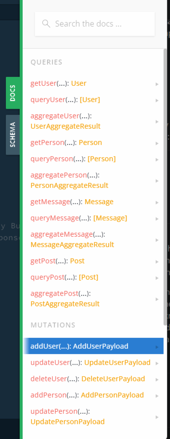
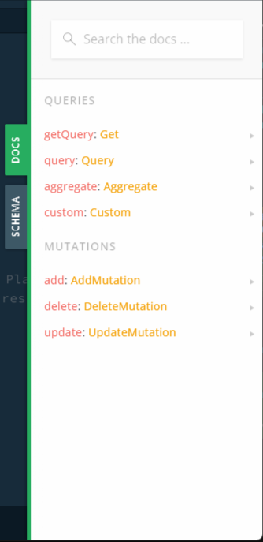

# Weasel (BETA)

A direct GraphQL "converter" to Dgraph's `DQL` language.

# UPDATE: Major Refactoring of Weasel: Transitioning from a Library to a Standalone Program

Hello everyone,

I am excited to announce that Weasel is undergoing a significant transformation. What began as a library designed for embedded work will now stand as an independent program. My key objectives for this refactoring include:


1. The ability to create multiple GraphQL APIs using the same database (Dgraph).
   * The possibility to segregate parts of your GraphQL API across various endpoints.
   * As the program is standalone, you can have numerous GraphQL APIs within the same context. Or even have pseudo-namespaces.
2. Complete mirroring of all Dgraph GraphQL functions.
3. Enhancements to several existing Dgraph GraphQL features.
4. Addition of more advanced custom queries and mutations.
5. Improved Authorization system.
6. Introduction of various new features like property validation, both in queries and mutations.

PS. You will be able to run both Weasel and Dgraph's GraphQL in parallel. With full backward compatibility.

Moreover, the program will leverage my expertise to consolidate all these changes.

One of the most significant changes will be the ability to send a schema consisting only of Types (similar to Dgraph), which will automatically generate all query and mutation resolvers(Like CRUD as Dgraph does). The previous Weasel's feature will continue to exist but improved.

# Why This Change?

The primary reason for this shift is simplicity. This is a terrain I've navigated before, and translating GraphQL to DQL is quite straightforward. With the power of TypeScript and the freedom that comes with being an independent program, we can achieve more and move faster.

My goal is to tackle known issues and simplify others. Granted, the code on the backend will become exponentially more complex. However, being in JavaScript allows for greater control and potentially more contributors to assist in the development, given that the pool of JavaScript developers is larger than that of Golang.

### Better Organization
First how it is in Dgraph.  | | And How it will be in Weasel.

 

## What is Weasel?

Weasel is a direct GraphQL "converter" to Dgraph's `DQL` language. It is proof of a concept that we can directly relate to both languages.

This project is inspired by join-monster. And it uses the Graphql's AST Object to do it's "magic".

# Before you try out (Please, ignore everything below. I will update this later. Everything is gonna change)

This code is extremely embryonic and simple. There is a lot of work to do yet.
BTW, help is welcome!

# Usage

> Check the example in `./example/*`

First create your basic apollo-server.

Add to your GraphQL Schema a especial GraphQL Directive.
e.g:

```GRAPHQL
directive @reverse on FIELD | FIELD_DEFINITION
directive @filter(func: String) on FIELD | FIELD_DEFINITION

# Also in the Types you have to define where the directive goes.

  type User {
    id: ID
    friend: [Friend] @reverse
  }

# Add the argument in the Query type.
  type Query {
    getUsers(func: String): [User] @filter #if you pretend to use filters at Root you need to add them in your query using the graphql custom directive `@filter`.
  }

```

## At your resolvers code import the weasel

```JS
import { extraction, mountUpsert } from 'weasel-dgraph';
```

And

```JS
export default {
  Query: {
    getObjects: async (parent, args, context, resolveInfo) => {
      const queryConverted = extraction(resolveInfo, args); // Here it will parse AST and convert to GraphQL+-
      return getAll.Objects(args, queryConverted); // Here goes your resolving code to Dgraph (works with dgraph-js and dgraph-js-http).
    },
  Mutation: {
    CreateObject: async (_, args, context, resolveInfo) => {
      const queryConverted = extraction(resolveInfo, args);
      const mutation = mutate.CreateObj(args.input); // you gonna use the graphql's input object to mutate in Dgraph.
      return get.Object(args, queryConverted, mutation.uid); // you have to return the UID from the mutation to do a query.
    }
  }
     }
};
```

Todo mutations, you need to execute two Dgraph operations. One mutation and then one query. Due to GraphQL's nature of doing a query and returning what was mutated. Dgraph doesn't have this. So you need to do two operations.

# Running GraphQL queries

To be able to use the reverse directive. You need first pass the `@reverse` directive in the reversible edge(s).

> Ids will be converted to `uid`.

Using Dgraph Type at query root.

```GRAPHQL
{
  getObjects(type: "\"Object\"") {
    id
    name
    friend @reverse {
      id
      name
    }
    otherEdge @reverse {
      id
      name
    }
  }
}
```

Using Dgraph's functions at query root.

```GRAPHQL
{
  getObjects(func: "eq(dgraph.type, \"Object\")") {
    id
    name
    friend @reverse {
      id
      name
    }
    otherEdge @reverse {
      id
      name
    }
  }
}
```

Using Value Facets.

> Because GraphQL does not support names with special characters (Such as | pipe, . dot and so on that Dgraph supports). You are required to use aliases with Facets.

```GraphQL
{
  getAlice(func:"eq(name, \"Alice\")"){
    id
    name
    mobile @facets(aliases: "mobile_since:since")
    mobile_since
    friend {
      name
      car @facets(aliases: "car_since:since")
      car_since
    }
  }
}
```

# Mutation and Upsert Block

All these examples you can find in ./examples

To insert data into Dgraph using Weasel, you can choose two ways. Payload or a Typed input.

```GraphQL
mutation {
  addDataset(input: {
    payload: " ... "
  })
}
```

```GraphQL
mutation {
  addPerson(input: [{
    uid: "_:Alice",
    name: "Alice",
    mobile: "040123456",
    car: "MA0123"} (...) ])
}
```

Upsert Block using type and val (val graphl directive mandatory in case of upsert).

> if you send an upsert mutation with root type "User" and the input type "Person". Both will be mutate. E.g. `dgraph_type: ["Person","User"]`

```GraphQL
mutation {
  upsertUser(type: "User",input: {
    uid: "uid(v)",
    name: "test",
    email: "user22@company1.io",
    dgraph_type: "Person"
  }) @filter(func: "eq(email, \"user22@company1.io\")") {
    id @var(val:"v")
    name
    email
  }
}
```

Upsert Block not using type function at root query.

> The field "dgraph_type" will be converted to "dgraph.type".

```GraphQL
mutation {
  upsertUser(func: "eq(email, \"user_a29@company1.io\")",input: {
    uid: "uid(v)",
    name: "test",
    email: "user_a29@company1.io",
    dgraph_type: "Person"
  }) {
    id @var(val:"v")
    name
    email
  }
}
```

If you send any upsert mutation without Type anywhere (Root or input), it will assign `"dgraph.type":"unknown"`.

```GraphQL
mutation {
  upsertUser(func: "eq(email, \"44user_88@company1.io\")",input: {
    uid: "uid(v)",
    name: "test",
    email: "44user_88@company1.io"
  }) {
    id @var(val:"v")
    name
    email
  }
}
```
